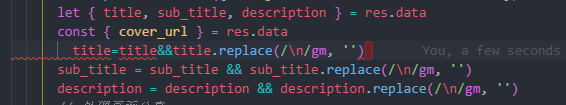
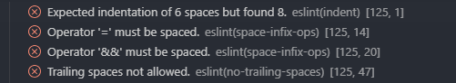
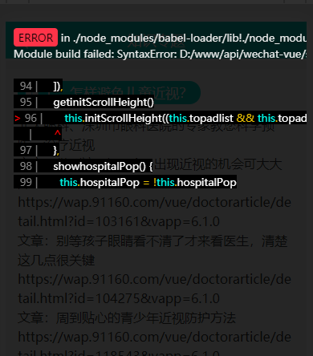

# 160FE 前端代码风格及规范总结

[![code style: prettier][prettier-badge]][prettier-link]
[![ESLint][eslint-badge]][eslint-link]
[![Commitizen friendly][commitizen]][commitizen-link]

上面这些 `badge` 引入了相应的代码规范后就可以自动在 `README` 中生成对应的徽章 😂

历史原因，微信端的项目其实没有明确的代码规范可言，经历了从 `sublime` 到 `webstorm` 到 `vscode`。随着编辑器的演变及维护人员的变更，项目代码中存在各式各类的代码风格。😱

为解决这个历史遗留问题，本次在项目中引入了

1. `eslint`
2. `eslint-plugin-vue`
3. `eslint-plugin-html`
4. `stylelint` 插件
5. `commitizen` 提交规范

等几个插件或配置来完善规范

最直观的好处：

1. 代码整齐、整洁、简洁
2. 可视化无用变量和错误提示点

潜在的好处：

1. 养成良好的代码习惯，追求代码整洁，提升代码自信
2. 避免一些常见的类型错误，变量未定义，变量名拼写错误等常见低级错误遗漏到线上

## eslint 配置项

刚开始用 `eslint` ，写一行代码给你报 4 5 个错误是很常见的。

比如这样：



错误输出：



如果是改旧代码的话，手动去改是相当费力的，也容易操作错。
但是如果是自己开发的新功能，建议没用过 `eslint` 的小伙伴，多动手改一改。

`eslint` 还是也有着很强大的自动修复功能，一个命令修复所有的报错也不是不可能。
不过有些写法还是 `eslint` 不会修复的，这就需要大家注意平时的代码风格和代码规范。

```js
// config/index.js
dev: {
  // 是否使用 eslint loader。
  // 如果使用了，代码将会在打包的时候被校验并且将错误和警告展示在控制台上
  useEslint: true,
  // 如果配置项为 true，eslint 的错误和警告会展示在浏览器的覆盖层上
  showEslintErrorsInOverlay: false,
}
```

`overlay` 选项就是我们常见的编译错误时的浮层



在 `vue` 的脚手架中，常见的配置是这样的

```js
// webpack.base.conf.js
function resolve (dir) {
  return path.join(__dirname, '..', dir)
}

const createLintingRule = () => ({
  test: /\.(js|vue)$/,
  loader: 'eslint-loader',
  enforce: 'pre',
  include: [resolve('src'), resolve('test')],
  options: {
    formatter: require('eslint-friendly-formatter'),
    emitWarning: !config.dev.showEslintErrorsInOverlay
  }
})

module.exports = {
  module.rules = [
    // 关键是这句
    ...(config.dev.useEslint ? [createLintingRule()] : []),
    {
      test: /\.vue$/,
      loader: 'vue-loader',
      options: vueLoaderConfig
    },
    {
      test: /\.js$/,
      loader: 'babel-loader',
      include: [resolve('src'), resolve('test'), resolve('node_modules/webpack-dev-server/client')]
    },
    // ...
  ]
}
```

## eslint 配置

```js
parserOptions: {
  parser: 'babel-eslint',
  sourceType: 'module'
},
env: {
  browser: true,
  node: true,
  es6: true
},
globals: {
  $: true,
  wx: true,
  gio: true,
},
plugins: [
  "html",
  "vue"
]
```

## eslint-vue-plugin

```js
'vue/max-attributes-per-line': [
  2,
  {
    singleline: 3,
    multiline: {
      max: 1,
      allowFirstLine: false
    }
  }
],
"vue/mustache-interpolation-spacing": ["off"],
"vue/singleline-html-element-content-newline": ["off", {
  "ignoreWhenNoAttributes": true,
  "ignoreWhenEmpty": true,
  "ignores": ["pre", "textarea"]
}],
"vue/order-in-components": ["error", {
  "order": [
    "el",
    "name",
    "parent",
    "functional",
    ["delimiters", "comments"],
    "extends",
    "mixins",
    "inheritAttrs",
    "model",
    ["components"],
    ["props", "propsData"],
    "data",
    "computed",
    "LIFECYCLE_HOOKS",
    ["directives", "filters", "watch",]
    ["template", "render"],
    "renderError",
    "methods"
  ]
}],
"vue/attributes-order": ["error", {
  "order": [
    "DEFINITION",
    "LIST_RENDERING",
    "CONDITIONALS",
    "RENDER_MODIFIERS",
    "GLOBAL",
    "UNIQUE",
    "TWO_WAY_BINDING",
    "OTHER_DIRECTIVES",
    "OTHER_ATTR",
    "EVENTS",
    "CONTENT"
  ]
}],
"vue/html-self-closing": ["error", {
  "html": {
    "void": "never",
    "normal": "never",
    "component": "always"
  },
  "svg": "never",
  "math": "never"
}],
'vue/name-property-casing': ['error', 'PascalCase'],
```

## 如何不影响现有代码

`eslint` 使用 `.eslintignore` 来添加排除文件/夹
`stylelint` 使用 `stylelint.config.js` 的 `ignoreFiles` 选项来排除文件/夹

### 有一行代码是别人写的，eslint 提示报错了，改起来可能会出问题，怎么办

在该报错代码上，添加一行 /* eslint-disable-next-line */ 注释，表示 `eslint` 不校验下一行代码

## stylelint 配置项

这个 `CSS` 校验插件相对来讲比较严格，甚至连模板上的 `CSS` 都校验了，好在它的自动修复也是非常强大。

### 主要讲讲 CSS 顺序

- Display & Flow (显示类型及浮动)
- Positioning (Position 布局相关)
- Flex (Flex 布局相关)
- Dimensions (元素的形状尺寸)
- Margins, Padding, Borders, Outline (外边距、内边距、边框、轮廓 —— 盒模型)
- Typographic Styles (字体样式)
- Backgrounds (背景属性)
- Opacity, Cursors, Generated Content, Transition (透明度，鼠标，content、过渡)
- Others （其他暂时没有在规则里的属性）

## npm script

```json
"lint": "yarn lint:js && yarn lint:css && yarn lint:assets",
"lint:js": "eslint --fix --ext .js,.vue src",
"lint:css": "stylelint src/**/*.vue src/**/*.less --fix",
"lint:assets": "stylelint src/assets/css/*.scss --custom-syntax ./node_modules/postcss-scss --fix",
```

## git 提交规范

- `feat`: 新特性
- `lint`: 代码格式化
- `fix`: 修复问题
- `refactor`: 重构代码
- `doc`: 文档修改注释修改
- `style`: 代码格式修改，注意修复 `CSS` 问题归类为 `fix`
- `build`: 代码构建打包
- `chore`: 其他修改，如构建流程，测试用例，新增依赖

好处：

1. 通过 `standard version` 自动生成 `changelog` 某一个 `tag` 的 `changelog`
2. 向开源项目提交 `PR` 的时候符合提交规范

```markdown

0.0.73 (2019-08-30)
## Bug Fixes
comment detail page comment invalid fix (6c81f32)
fire console.log (d751aa3)
fix detail page content wrap and br and /n etc (8a86f7a)
fix save and restore story draft (bf496be)
fix share image http origin (3d127d1)
fix share post (90271a4)
generate post error (7cdf1f2)
handle welfare detail cannot comment (119493f)
update share and document.title (247d122)
using a tag for href routing (8c5b27b)
## Features
add welfare share func (0039209)
avoid duplicate save (43f2bda)
```

## 其他

1. 能用 `es6` 就用 `es6`
2. 能不用 `jq` 就不用 `jq`
3. 能用 `UI` 框架完成的事情就尽量少手写
4. 熟练掌握操作数组的 `N` 种方法
5. 可读性和可维护性比一丁点性能重要

## 总结 & 期望 🚀

1. 能用则用，尽早养成良好的代码习惯和风格，提升代码自信。
2. 渐渐扩大校验的业务影响，争取早日实现全业务有校验工具加持。

## 参考 :blue_book: 文献

[Airbnb JavaScript Style Guide](https://github.com/airbnb/javascript)

[Order of the Day: CSS Properties  Andy Ford](http://fordinteractive.com/2009/02/order-of-the-day-css-properties/)

[prettier-badge]: https://img.shields.io/badge/code_style-prettier-ff69b4.svg
[prettier-link]: https://github.com/prettier/prettier
[eslint-badge]: https://img.shields.io/badge/code%20style-ESLint-purple.svg
[eslint-link]: https://github.com/eslint/eslint
[commitizen]: https://img.shields.io/badge/commitizen-friendly-brightgreen.svg
[commitizen-link]: http://commitizen.github.io/cz-cli/

## 致谢 :heart: 160FE
